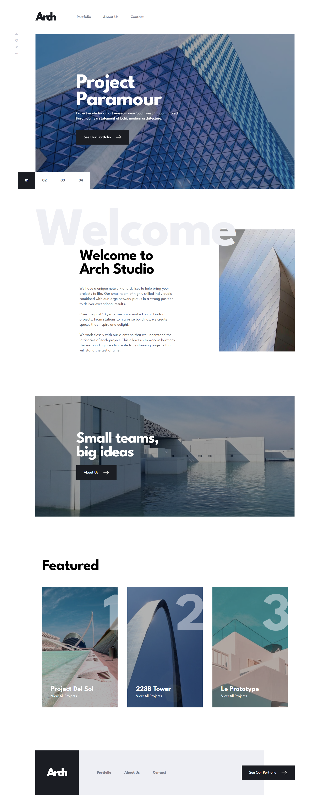

# Frontend Mentor - Arch Studio multi-page website solution

This is a solution to the [Arch Studio multi-page website challenge on Frontend Mentor](https://www.frontendmentor.io/challenges/arch-studio-multipage-website-wNIbOFYR6). Frontend Mentor challenges help you improve your coding skills by building realistic projects.

### Screenshot

### Links

- Solution URL: (https://your-solution-url.com)
- Live Site URL: (https://your-live-site-url.com)
- Repository URL: ()

## My process

- First of all create a React project (because I'm working of React).
- Remove all the unesassary files and all my own files and folders to create a better architecture.
- Add font awesome and Google fonts to every website I develope.
- Setup Sass
- And from here I begin to write the story of the website😋

### Built with

- Love ❤️😋
- Semantic HTML5 markup
- CSS custom properties
- Sass
- Flexbox
- [React](https://reactjs.org/) - JS library

### Continued development

In this project I've learned a lot and some of the things I'll take from this project are:

- Routing (obviously)
- File Architecture and Sass
- Using Helmet Library to change the title of the page while routing

### Useful resources

- [Implementing Open Map](https://www.youtube.com/watch?v=62Y8SFi2wBk) - This helped me for implementing the Leaflet Map in React. I really liked this video and I think it will help you.

## Author

- Frontend Mentor - [@adarshcodes](https://www.frontendmentor.io/profile/adarshcodes)
- Linkedin - 
- Instagram -[@officiallyAdarsh] (https://www.instagram.com/officiallyadarsh/)
- Twitter - [@ideallyAdarsh](https://twitter.com/ideallyadarsh)

## Acknowledgments

I was stuck and was thinking about how to implement the image slider and this repository helped me in figuring out this.

https://github.com/warz66/FMentor-ArchStudio
